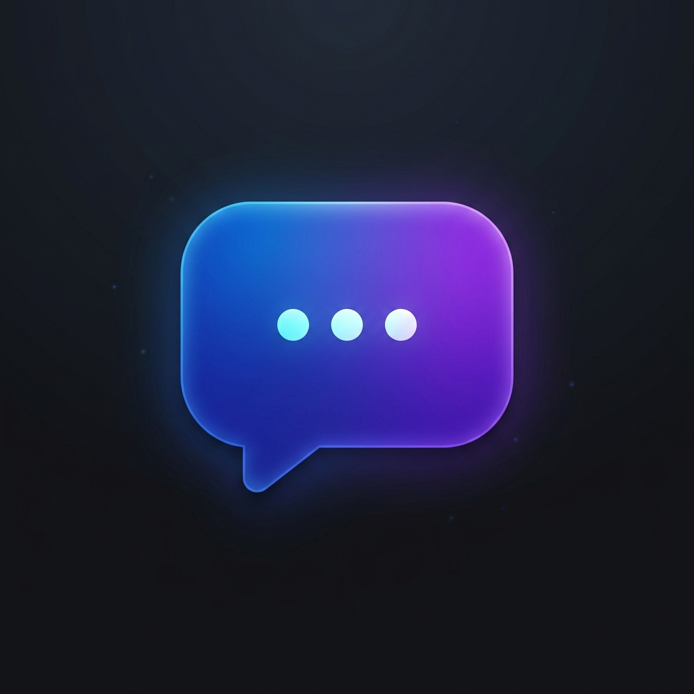
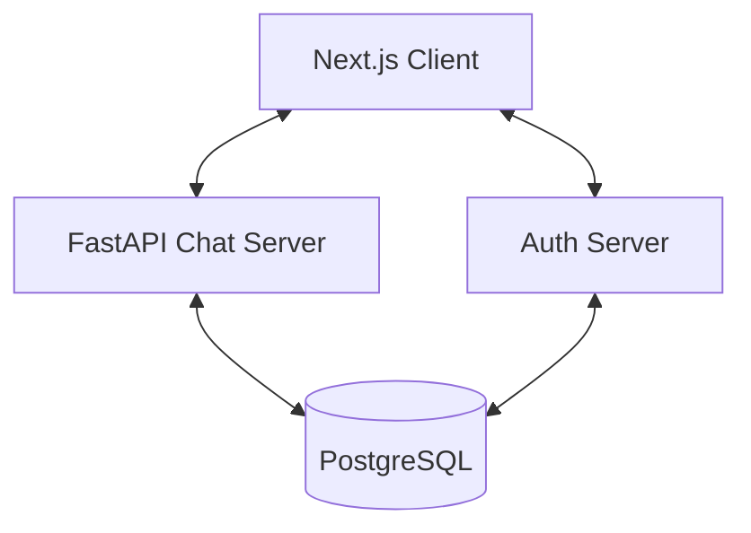

<p align="center">
  
</p>

# WebChat: Secure & Modern Communication
live link : [webchat.aniksutradhar.com](https://webchat.aniksutradhar.com)

A high-performance, full-stack real-time messaging application built with **FastAPI**, **Next.js**, and **WebSockets**. Designed for speed, security, and a seamless user experience.

---

## Features

### Real-Time Messaging
- **Instant Delivery**: Powered by WebSockets for sub-100ms latency.
- **1:1 & Group Chats**: Seamlessly transition between private conversations and collaborative groups.
- **Typing Indicators**: Real-time feedback when your contacts are active.
- **Persistence**: Full message history stored securely and retrieved efficiently.

### Secure Authentication
- **Dedicated Auth Service**: A standalone authentication server for maximum security and modularity.
- **JWT Protection**: Secure token-based authentication for all API and WebSocket connections.
- **User Management**: Robust registration, login, and profile handling.

### Modern UI/UX
- **Sleek Interface**: Built with Tailwind CSS 4 for a premium, responsive look.
- **Optimized Performance**: Virtualized message lists using `react-virtuoso` to handle thousands of messages without lag.
- **Emoji Support**: Integrated emoji picker for expressive communication.
- **Responsive Design**: Flawless experience across mobile, tablet, and desktop.

---

## Tech Stack

### Frontend
- **Framework**: Next.js 16 (App Router)
- **Language**: TypeScript
- **Styling**: Tailwind CSS 4
- **Performance**: React Virtuoso (Virtual Lists)
- **Features**: Emoji Picker React, Lucide Icons

### Backend
- **Core**: FastAPI (Python)
- **Real-Time**: WebSockets
- **Authentication**: JWT, Passlib (bcrypt)
- **Database ORM**: SQLAlchemy (Async)

### Infrastructure
- **Containerization**: Docker & Docker Compose
- **Production Ready**: Optimized multi-stage builds and production configurations.

---

## Architecture

The system is designed as a distributed monorepo for better scalability and separation of concerns:

- **`chat-client/`**: The Next.js frontend application.
- **`chat-server/`**: The FastAPI WebSocket and REST API for messaging.
- **`auth-server/`**: Standalone authentication and user management service.



---

## Getting Started

### Prerequisites
- Docker & Docker Compose
- Node.js (for local dev)
- Python 3.12+ (for local dev)

### Quick Start (Docker)
1. Clone the repository.
2. Run the services:
   ```bash
   docker-compose up --build
   ```
3. Access the app at `http://localhost:6000`.

### Local Development
Check individual directories for detailed setup instructions:
- [Chat Client](chat-client/README.md)
- [Chat Server](chat-server/README.md)
- [Auth Server](auth-server/README.md)

---

## Project Structure

```text
Webchat/
├── auth-server/       # Authentication service
├── chat-client/       # Next.js frontend
├── chat-server/       # Real-time messaging backend
├── scripts/           # Deployment and utility scripts
└── database diagram.png
```

---

